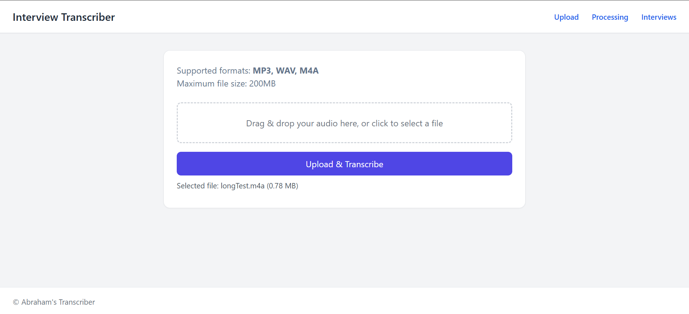
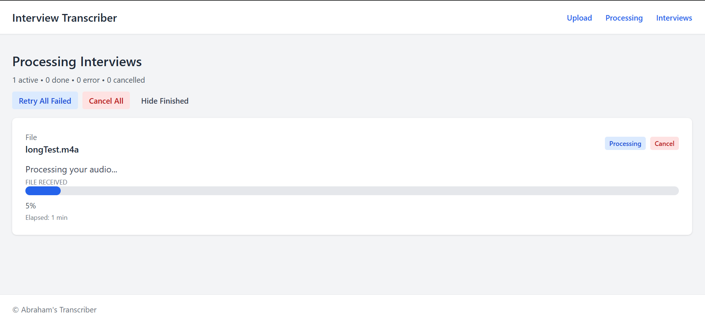
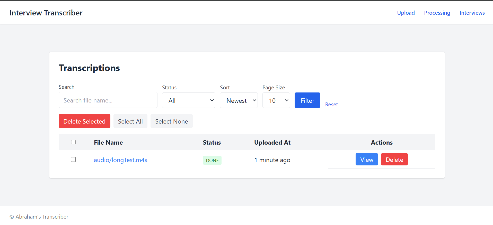
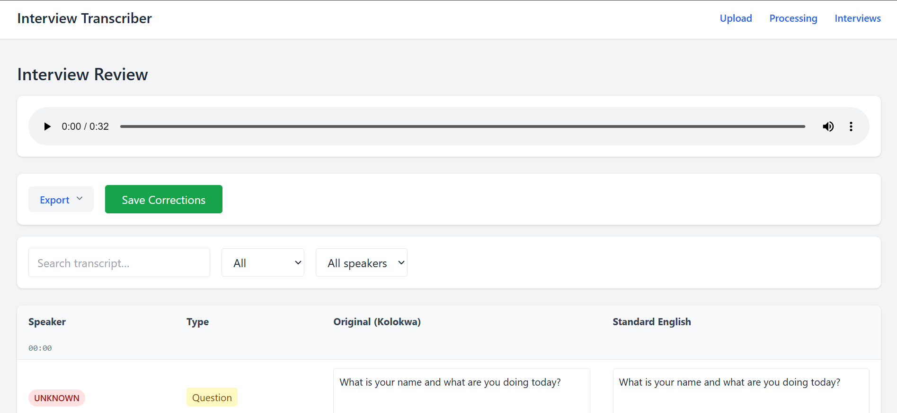

# Transcriber Project

## Overview
Web app for uploading audio and generating structured transcripts with a review UI. It supports Liberian local pidgin.

Note: Transcription to Liberian Pidgin is not perfect and may contain mistakes. User review is advised.


## Requirements
- Python 3.11+
- Redis (for Celery broker)
- ffmpeg + ffprobe on PATH

## Setup
1. Create and activate a virtual environment.
2. Install dependencies:
   ```bash
   # For Linux environment
   pip install -r requirements.txt
   ```
   ```bash
   # For Windows Environment
   pip install -r requirements_windows.txt
   ```
3. Set environment variables:
   ```bash
   # Windows (PowerShell)
   $env:DJANGO_SECRET_KEY="replace-with-your-secret"
   ```
   ```bash
   # Linux/macOS (bash/zsh)
   export DJANGO_SECRET_KEY="replace-with-your-secret"
   ```

## Run Django
```bash
python manage.py migrate
python manage.py runserver
```

## Run Celery
```bash
celery -A transcriber_project worker --concurrency=3 --pool=prefork -l info
```

## Quickstart
```bash
python -m venv venv
pip install -r requirements.txt
python manage.py migrate
python manage.py runserver
```

## Project Structure
```
transcriber_project/
  settings.py
  urls.py
  celery.py
transcription/
  exports/
  services/
  templates/
  templatetags/
  tasks.py
  views.py
manage.py
```

## Notes
- Uploaded files are stored in `media/` (ignored by git).
- SQLite database is stored in `db.sqlite3` (ignored by git).

## Screenshots





## License
MIT © 2026 Abraham K. Blama

## Production Checklist
1. Set a strong `DJANGO_SECRET_KEY` in environment variables.
2. Set `DEBUG=False`.
3. Configure `ALLOWED_HOSTS`.
4. Use a production database (PostgreSQL recommended).
5. Configure Redis for Celery in production.
6. Ensure `ffmpeg` is installed on the server.

## Future Roadmap
1. GPU acceleration for faster transcription at scale.
2. Audio storage cleanup and external storage integration (e.g., S3).
3. Multi-user accounts and permissions.
4. Improved error recovery and logging.
5. Full-text search across transcripts.
6. Export quality improvements and formatting options.
7. Stronger security for public deployments (HTTPS, access controls).
